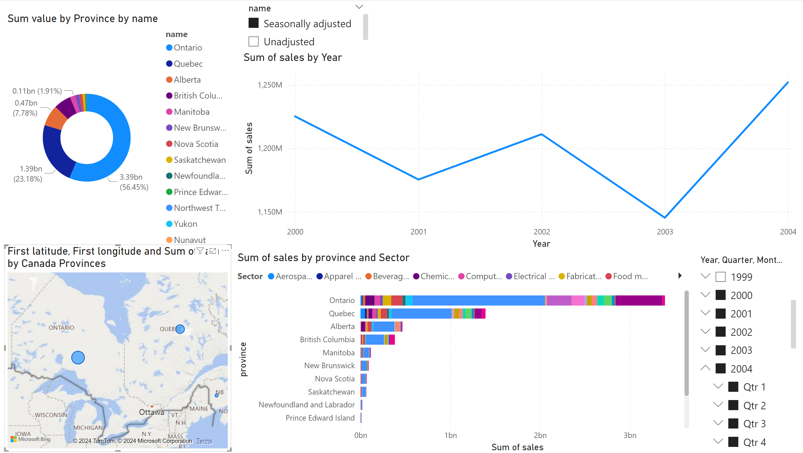

# Canada Manufacturing sales | Data Engineering Project

## Introduction

This repository houses an Airflow pipeline designed to automate the ingestion, cleaning, and transformation of monthly provincial and territorial manufacturing sales data from Statistics Canada. The data, categorized by NAICS codes and presented in thousands of dollars, is processed to ensure data quality and consistency.

### Key Components:

*  Data Extraction: Retrieves raw data from the designated source (CSV files).
*  Data Cleaning: Identifies and addresses data quality issues, such as missing values, outliers, and inconsistencies.
*  Data Transformation: Transforms the raw data into a standardized format suitable for analysis and storage.
*  Data Loading: Loads the cleaned and transformed data into a PostgreSQL database for persistent storage and further analysis.

By automating these data engineering tasks, this pipeline streamlines the data preparation process, enabling timely and accurate insights.

## Arquitecture

## Tools:
1.  Programming Language - Python
2.  Scripting Language - SQL
3.  Pipeline software - Airflow
4.  Data warehouse - PostgreSQL database
5.  Visualisation - PowerBI
6.  Environments - Docker

## Dataset Used
*  Meta Data 16100048_MetaData.csv - [datasets.zip](Datasets/datasets.zip)
*  Dataset 16100048.csv - [datasets.zip](Datasets/datasets.zip)

## Data Sources

-  Gouverment of Canada - https://open.canada.ca/data/en/dataset/ad32210b-e18b-4a4f-9305-7cea2002b737
-  Statistics Canada - https://www.statcan.gc.ca/en/developers/csv/user-guide
-  List of all state's in Canada with Latitude and Longitude - https://geokeo.com/database/state/ca/

## Data Model

## Environments
*  Airflow [docker-compose.yml](Docker/airflow/docker-compose.yml)
*  PosgreSQL [docker-compose.yml](Docker/postgresql/docker-compose.yml) 

## Scripts

*  [Dags](Docker/airflow/dags/)

## Visualisations

* Canada Sales [Canada_Manufacturing_Sales](Visualisation/)

