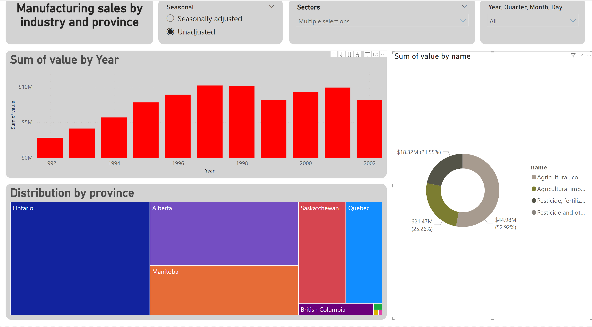
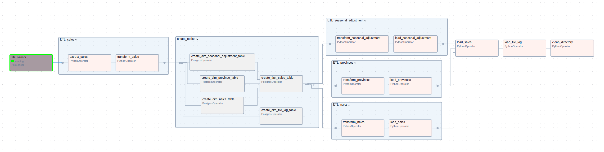

| CSVs | AIRFLOW | POSTGRESQL | DOCKER | POWERBI |
|---|---|---|---|---| 
| Data Source | ETL Pipeline | Data Storage | Containerization | Data Visualization |


## Introduction

This repository houses an Airflow pipeline designed to automate the ingestion, cleaning, and transformation of monthly provincial and territorial manufacturing sales data from Statistics Canada. The data, categorized by NAICS codes and presented in thousands of dollars, is processed to ensure data quality and consistency.

### Key Components:

*  Data Extraction: Retrieves raw data from the designated source (CSV files).
*  Data Cleaning: Identifies and addresses data quality issues, such as missing values, outliers, and inconsistencies.
*  Data Transformation: Transforms the raw data into a standardized format suitable for analysis and storage.
*  Data Loading: Loads the cleaned and transformed data into a PostgreSQL database for persistent storage and further analysis.

By automating these data engineering tasks, this pipeline streamlines the data preparation process, enabling timely and accurate insights.


## Arquitecture


## Tools:
1.  Programming Language - Python
2.  Scripting Language - SQL
3.  Pipeline software - Airflow
4.  Data warehouse - PostgreSQL database
5.  Visualisation - PowerBI
6.  Environments - Docker


## Data Model


## Environments

####  Arflow will we deploy with Astro CLI:

* Create an Astro project (go to directory project to execute this command)
```bash
astro dev init
```
* To run Astro project locally:
```bash
astro dev start
```
*  To restart and update with new changes:
```bash
astro dev restart
```
*  To stop and mremove the Docker Compose containers and volumes:
```bash
astro dev stop
```

*  First time you must import/configure this parameters:
    *  Import in Airflow/Admin/Variables - [variables.json](variables.json)
    *  Import not declared in Admin/Variables are declared in .env variable - [.env](.env)

    *  Add Postgress connection in Airflow/Admin/Connections [posgress-connection](assets/img/Admin-Connection.png)


####  PosgreSQL Dataware house:

In Docker_Compose_DataWarehouse folder launch [docker-compose](Docker_Compose_DataWarehouse/docker-compose.yml) file.

```yml
services:
  postgres_db:
    image: postgres:latest
    container_name: postgres_canada-sales
    ports:
      - 50432:5432  # Port mapping change because airflow DB use 50432
    volumes:
      - ./postgres-datawarehouse:/var/lib/postgresql/data
    environment:
      - POSTGRES_PASSWORD=postgres
      - POSTGRES_USER=postgres
      - POSTGRES_DB=canadasales 
    
volumes:
  postgres-datawarehouse:   
```

* Launch in docker-compose.yml directory:

```bash
docker compose up -d
```

*  Users and Password:
    *  Airflow:   
        *  User: Admin
        *  Password: Admin
    *  Posgres:
        *  Database: canadasales
        *  User: postgres
        *  Password: postgres


## Scripts
*  [Dags](dags/)

## Visualisations
* Canada Sales [Canada_Manufacturing_Sales](Visualisation/)




## Airflow Pipeline



## Dataset Used
*  Dataset 16100048.csv - [datasets.zip](datasets/datasets.zip)

## Project Resources
-  Gouverment of Canada - https://open.canada.ca/data/en/dataset/ad32210b-e18b-4a4f-9305-7cea2002b737
-  Statistics Canada - https://www.statcan.gc.ca/en/developers/csv/user-guide
-  List of all state's in Canada with Latitude and Longitude - https://geokeo.com/database/state/ca/
-  Astro CLI - https://www.astronomer.io/docs/astro/cli/overview


